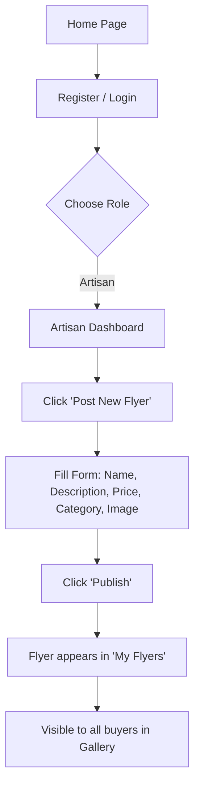
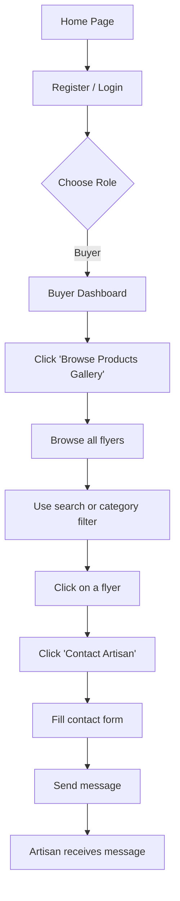
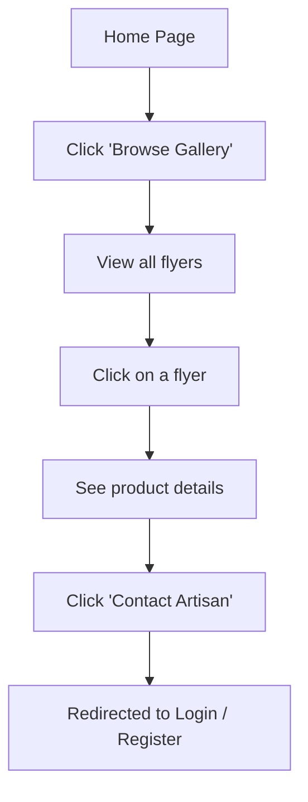
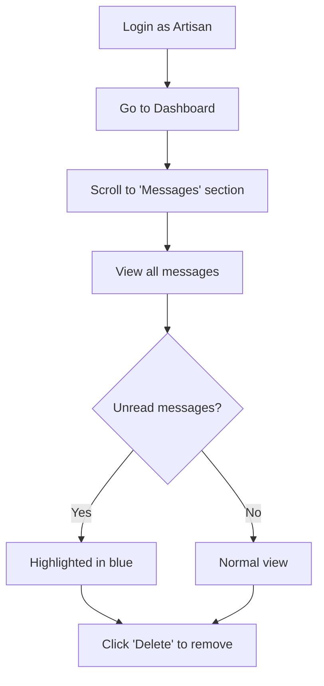
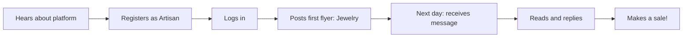
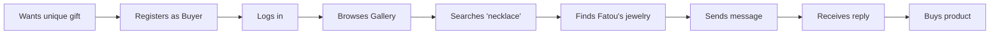

# 🔁 User Flows — Artisan Market

---

## 1. Artisan Flow — Post a Flyer

---

## 2. Buyer Flow — Discover and Contact

---

## 3. Guest Flow — Browse Without Account

---

## 4. Artisan Flow — Receive and Manage Messages

---

## 5. Complete User Journey — Fatou (Artisan)

---

## 6. Complete User Journey — Mamadou (Buyer)

